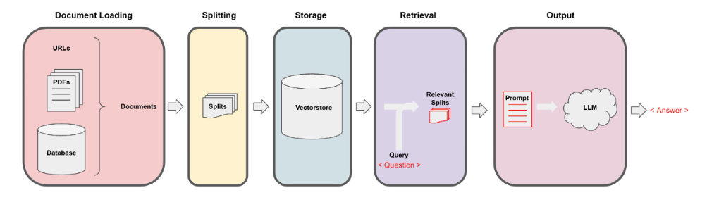

# Generative AI knowledge

This project sets an environment to test Generative AI both in a native way and by using the [LangChain](https://www.langchain.com/) framework.

The idea is to set a Docker component to implement the Retrieval-augmented generation (RAG) pattern to implement a chat based on custom knowledge. This would be the schema of our implementation:

